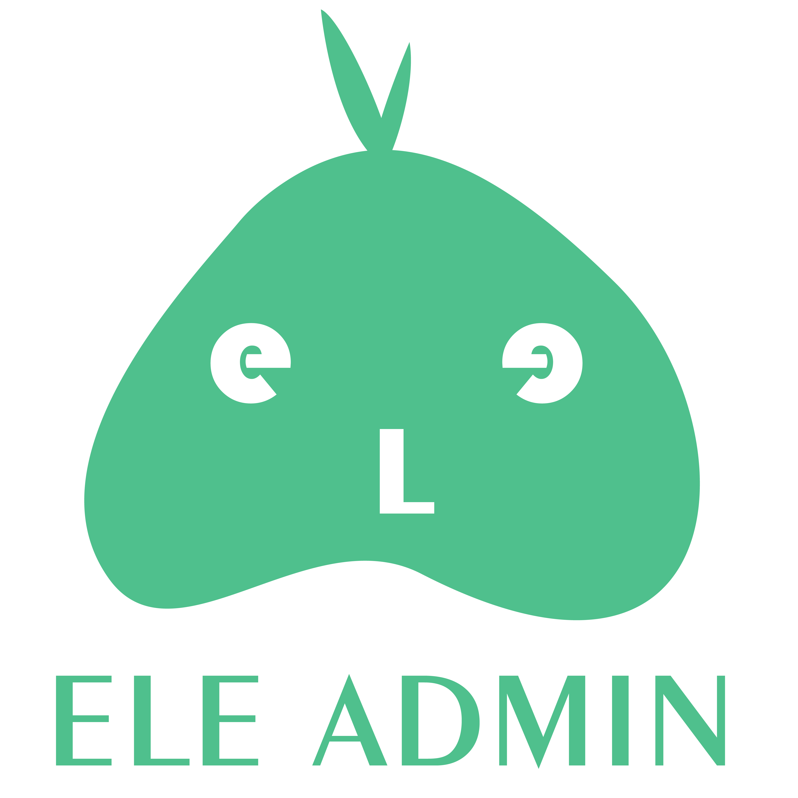

  

  

  
  

ELE-Admin 是基于 Vue 3 + TypeScript + Vite + Element Plus + Pinia 开发的、适用于中小型项目的简约管理系统项目框架。

## 功能特性
- [x] 常用PC端电脑分辨率自适应
- [x] 多级菜单
- [ ] 动态路由
- [ ] 权限控制

## 开发特性
1. TypeScript 支持
2. Vue 3.2x setup 语法糖
3. mockJS 开发支持
4. Element Plus 组件自动导入
5. git commit 提交规范
6. Eslint, Prettier 代码规范

## 特别鸣谢
**设计师：@今煕**，包含本项目的UI设计、界面设计、插画设计等几乎所有的设计工作，衷心感谢您的踏实且勤劳的工作，
让项目能够得到快速推进！
